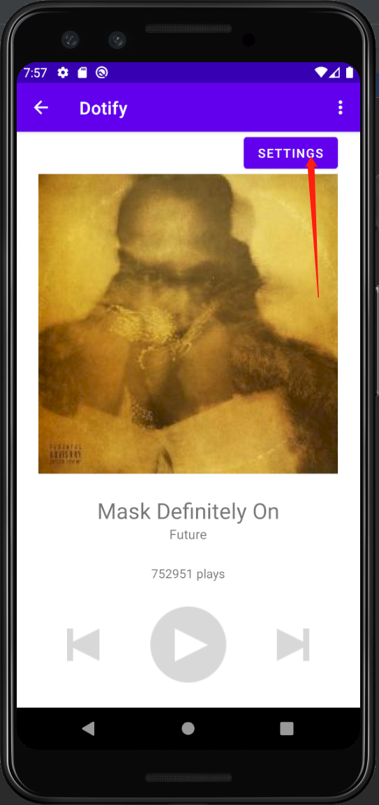
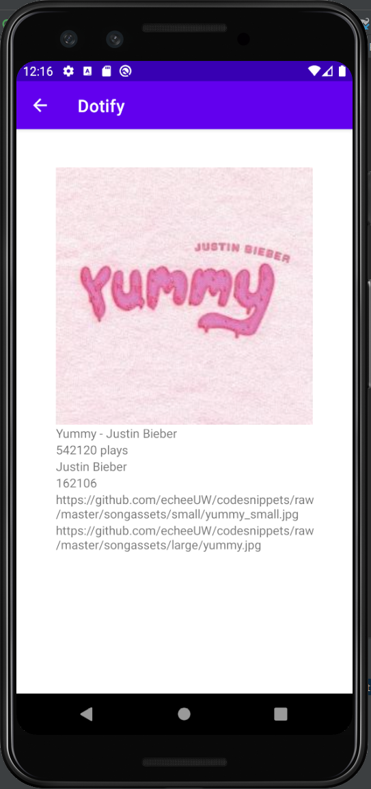
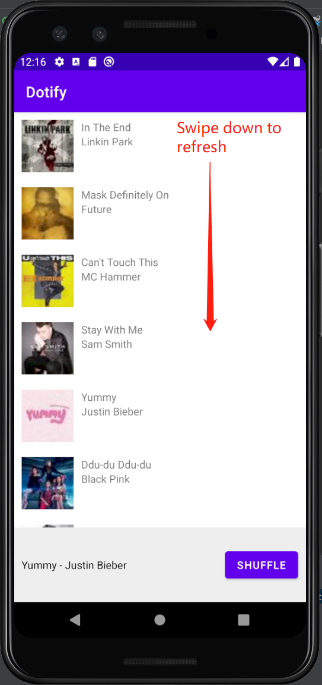

# Dotify [Zhewen Zheng]

This is a music player app with songs in a list. You can shuffle the list by clicking "Shuffle".
Details about a song can be accessed following the instructions below.

## Extra credit (Attempted)

1. Show a stock Android back arrow button, ←, in the Header/Toolbar of Activity B. When clicked, it
should navigate back to SongListActivity (+.25)
2. (+.25) Long pressing on an item should delete that song on the list.
a. It should show a Toast that says what song was deleted.
3. When a user presses shuffle, the list should animate the changes using DiffUtil (+1)

## Screenshots

## Installation & Usage

Import the Project in Android Studio and Run the App. See screenshots for image instructions.
