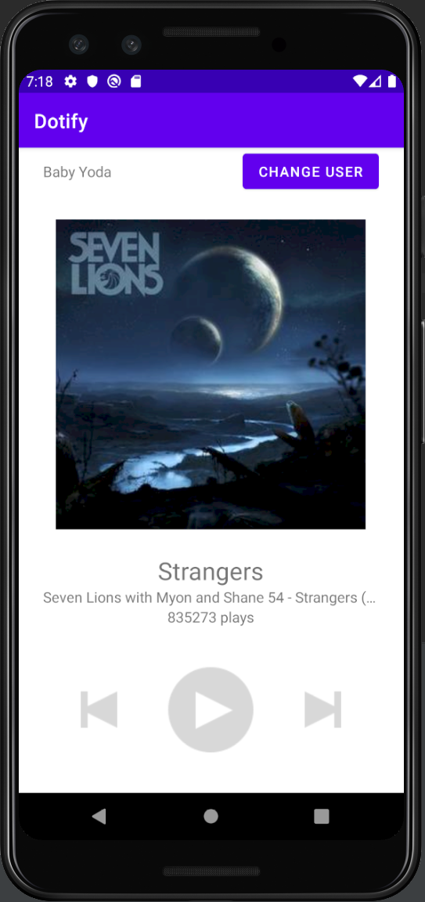

# Dotify [Zhewen Zheng]

This is a music player app (only layouts).

## Extra credit (Attempted)

1. A user is not allowed to apply a new username if the edit text field is empty. (+ 0.25)
2. Long pressing on the cover image changes the text color of the play count to a different color. (+ 0.25)
3. If using ConstraintLayout, utilize a Barrier or Guideline somewhere with a view constrained to it (+0.25)
4. All hardcoded dimensions & colors are extracted into res/values/dimens.xml & res/values/colors.xml
   respectively (+ .5)
5. Create another xml file that uses a different ViewGroup type than your original. (+ 1)
   a. i.e. If you used a ConstraintLayout for your homework, this second xml uses LinearLayouts, and
   vice versa (I recommend at least one of your xml files should use ConstraintLayout)

## Screenshots

## Installation & Usage

Import the Project in Android Studio and Run the App.
