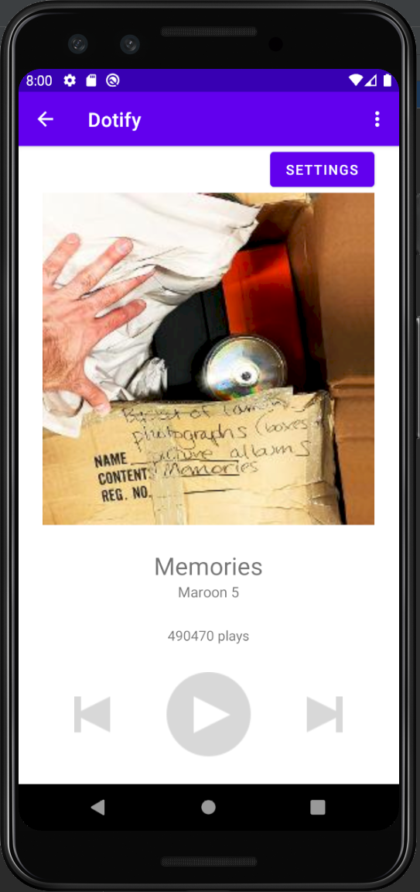

# Dotify [Zhewen Zheng]

This is a music player app with songs in a list. You can shuffle the list by clicking "Shuffle".
You can refresh the list by pulling down. Visiting the settings in the Music Player screen you can
turn on **auto refresh**. This sends a notification about a random song every 20 minutes. Click the
notification to open the song in the player.
Details about a song can be accessed following the instructions below.

## Extra credit (Attempted)
1. Add pull down to refresh function to your activity to trigger an HTTP fetch (+.25)

## Screenshots
WorkManager Specifics:

## Installation & Usage

Import the Project in Android Studio and Run the App. See screenshots for image instructions.
