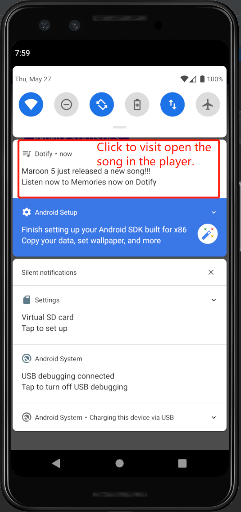

# Dotify [Zhewen Zheng]

This is a music player app with songs in a list. You can shuffle the list by clicking "Shuffle".
Details about a song can be accessed following the instructions below.

## Extra credit (Attempted)
1. Every Fragment (other than SettingsFragment) has a Up/back button in the top right corner. Clicking
will take you back to the previous fragment (+.25)
2. Instead of Settings <Button> in your layout from requirement #1, make a Settings "Action Button” in
the app bar (header bar at the top). https://developer.android.com/training/appbar/actions (+.25)

## Screenshots

## Installation & Usage

Import the Project in Android Studio and Run the App. See screenshots for image instructions.
